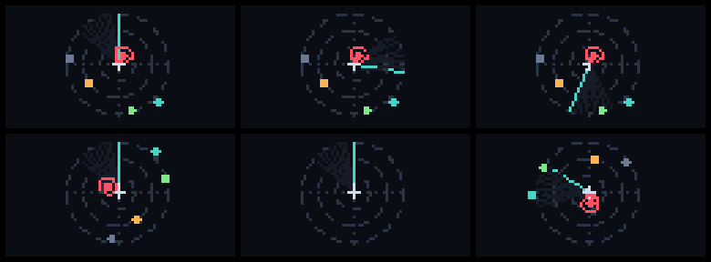
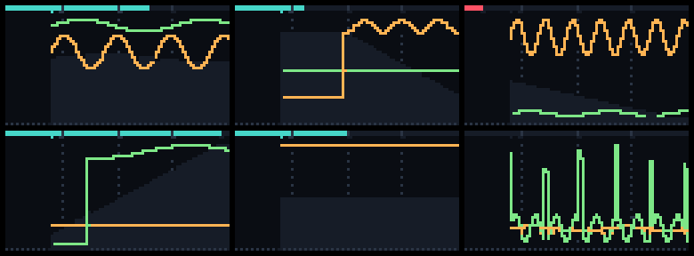
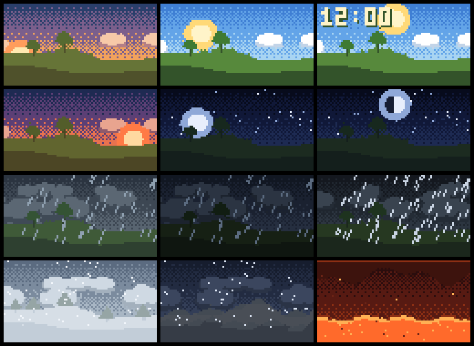
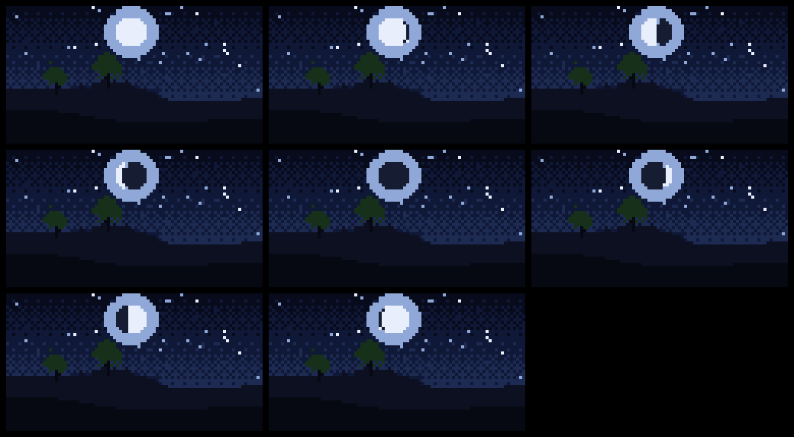
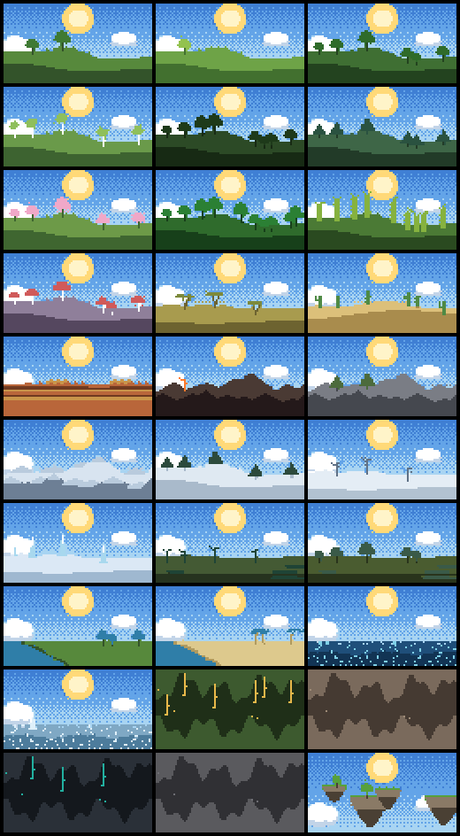
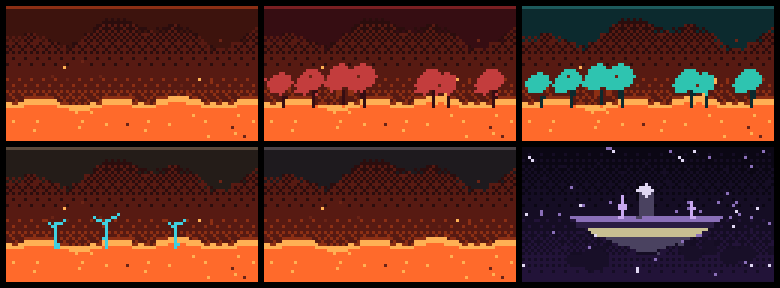
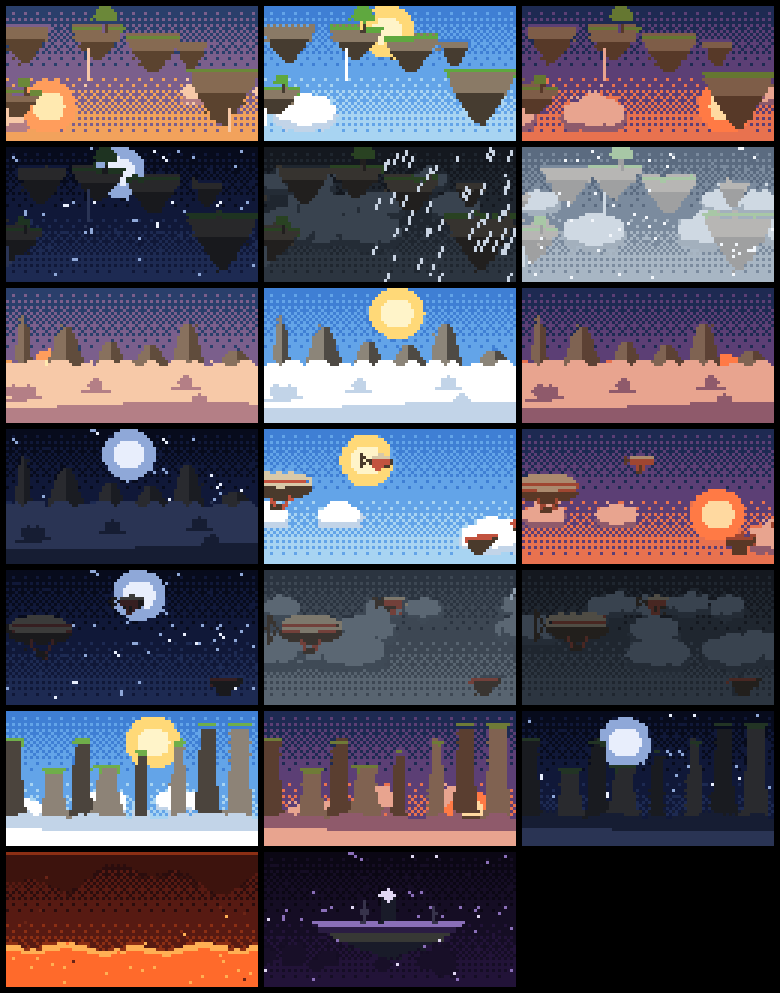
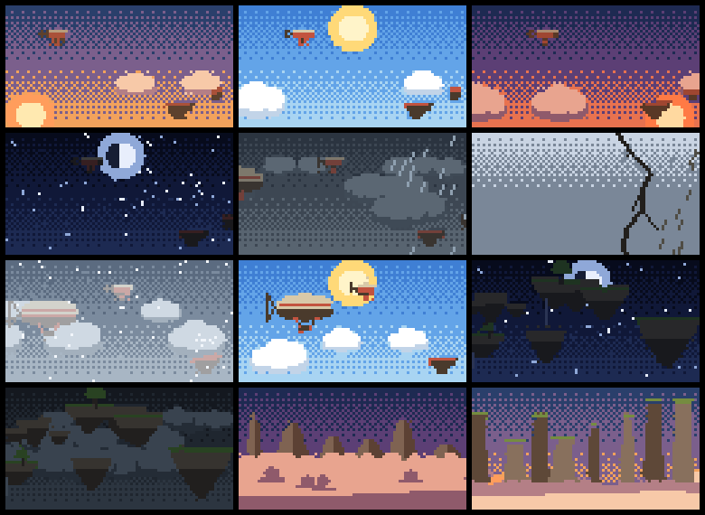

# Radar Station

A player radar, weather display and power monitor for **CC: Tweaked +
Advanced Peripherals** on **Minecraft 1.21.1**, built on the
[Basalt 2.5](https://basalt.madefor.cc/2.5/) UI framework.

Every page is a **module** — one file in `radar/modules/` that owns its page,
its settings, its hardware and its background polling. Drop a file into that
folder and the station has a new page. Nothing else needs editing.

It runs in three places, and asks which on first boot: the **main base** with
the detectors and monitors, a **pocket computer** in your hand, or an
**airship** in the air. The main base does all the scanning and feeds the rest
over rednet — along with energy readings collected from any number of
**power clients** dotted around your build.



---

## Contents

- [Install](#install)
- [Hardware](#hardware)
- [Profiles](#profiles) — base, pocket, airship
- [Pages](#pages) — and a symbol per contact on the scope
- [Settings](#settings) — the index, and why it is two levels
- [Modules](#modules) — the plugin system, and how to write one
- [Flight](#flight) — speed, climb and course from the pilot's position, and the autopilot
- [Power](#power) — and the power clients that feed it
- [Weather and backdrops](#weather-and-backdrops)
- [Orientation](#orientation-locked-or-unlocked)
- [The network: main base, mobiles and power clients](#the-network-main-base-mobiles-and-power-clients)
- [Alerts and the alert log](#alerts-and-the-alert-log) — the unread marker, and what "alert within" covers
- [Keyboard and monitors](#keyboard-and-monitors)
- [Project layout](#project-layout)
- [Development](#development)
- [Version history](#version-history)

---

## Install

On the computer in game:

```
wget run https://raw.githubusercontent.com/Doom6197/CC-Radar-Station/main/install.lua
```

That pulls down all 32 files and offers to install Basalt 2.5 for you. Then:

```
radar
```

or pass your base coordinates straight in:

```
radar 120 64 -340
```

On first boot it asks what the computer is bolted to and what your username
is. Both are ordinary settings afterwards.

### Installer options

| | |
|---|---|
| `--startup` | also write a `startup.lua` so it launches on boot |
| `--dir <path>` | install somewhere other than the current directory |
| `--no-basalt` | skip the Basalt check |
| `<owner>/<repo>` | install from a fork |
| `<branch>` | install from a branch other than `main` |

```
wget run <url> --startup
wget run <url> dev --dir /apps
```

Run the same command again any time to update — it downloads everything into
memory first and only writes once every file has arrived, so a dropped
connection leaves the computer exactly as it was. It also **removes files an
earlier version shipped and this one does not** (a `-` line in `manifest.txt`),
because a renamed module left on disk goes on being loaded beside the one that
replaced it. Modules you dropped in yourself are never touched. **Settings from every earlier
version are imported automatically**, and an upgrade never sees the first-boot
questions: what is already on disk is your answer to them.

### Installing by hand

Copy `radar.lua` and the whole `radar/` folder next to `basalt.lua`:

```
/basalt.lua
/radar.lua
/radar/…
```

Basalt itself: `wget run https://basalt.madefor.cc/2.5/install.lua minified`

---

## Hardware

**Required**

- Advanced Computer (advanced, for colour)
- **Player Detector** (Advanced Peripherals) — adjacent, or on a wired modem
  network shared with the computer.
  **Not needed by a MOBILE**, which carries no detector at all.

**Optional — each unlocks a module**

| Peripheral | Unlocks |
|---|---|
| **Environment Detector** | the Weather page: live sky, biome scenery, moon phase, light levels |
| **Energy Detector**, inline in a cable | the Power page: transfer rate, and a settable limit |
| Any wrappable battery — induction matrix, energy cell, flux point | stored and capacity on the Power page |
| **Wireless or ender modem** | the MAIN BASE and MOBILE roles, and power clients. Use an **ender** modem: no range limit, works across dimensions |
| **Advanced Monitor(s)** | any size; each monitor gets its own page |
| **Speaker(s)** | every speaker on the network plays the alert |
| **Redstone Relay** (CC: Tweaked), on a wired modem | the flight page's [autopilot](#autopilot): two sides driving the left and right thruster groups |
| Any redstone contraption on a side of the computer | the redstone output |
| **CC: Sable**, on a computer riding a Create: Simulated Sub-Level | the flight page reads the **ship itself** — see [Reading the ship](#reading-the-ship) |

Peripherals are matched on **what they can do**, not on their type name, so a
Player Detector works whether it is bolted to the computer, built into a pocket
computer, or somewhere on a wired modem network — and a battery from a mod this
was never tested against is recognised as long as it answers something like
`getEnergy()` and `getMaxEnergy()`.

---

## Profiles

The same station runs in three very different places, and each wants different
defaults rather than different code. On first boot it asks which:

| Profile | What it sets up |
|---|---|
| **MAIN BASE** | the master. A fixed, chunk-loaded installation: monitors get their own pages, the scope holds a fixed bearing, every module on, and it feeds everything else over the network. |
| **POCKET** | carried in hand. Sweeps and polls slow down, the animation stops, the scope turns with you in 45° steps, the Power page is off. |
| **AIRSHIP / VEHICLE** | aboard something that moves. The scope follows the pilot's heading and eases into turns. |

The choice is **offered, not guessed**. Hardware is a poor proxy for intent: a
pocket computer is unmistakable, but a main base and a vehicle carry
identical peripherals and differ only in what they are attached to.

The **role** is not part of the profile: it follows from whether there is a
modem. With one, the base profile becomes the **MAIN BASE** and the other two
become **MOBILE**; without one, all three are **STANDALONE**.

A profile is applied **once**. It is not a mode the rest of the program keeps
checking — afterwards every setting it touched is an ordinary setting you can
change like any other, and **every one of them has its own row in Settings**:
tracking mode, the scope, heading steps, heading rate, eased turns, animation,
sweep rate, screen flash and the banner. Reapply or switch under
**Settings → Station → This station**; doing so overwrites the settings it covers, which is the
point of it.

---

## Settings

The settings page is an **index of eight groups**, each showing its own current
state — so it is a report on the station as much as it is a menu. Pressing one
fills the page with that group.

```
 SETTINGS   v8.23                                    |  SETTINGS   v8.23
 -------------------------------------------------  |  ---------------------
 STATION       MAIN BASE "Hangar"                   |  STATION
 TRACKING      BASE   120, 64, -340                 |  MAIN BASE
 SCANNING      10k   every 1s   1 ignored           |  TRACKING
 SCOPE         locked - 45 deg, NE up               |  BASE 120, -340
 ALERTS        ON   sound, flash, banner, redstone  |  SCANNING
 DISPLAYS      terminal: status   1 monitor         |  10k   1s
 PAGES         9 of 9 on                            |  SCOPE
 KEYBOARD      shortcuts and monitor taps           |  locked
                                                    |  ALERTS
 Quit Radar Station                                 |  ON   4 channels
```

| Group | What is in it |
|---|---|
| **Station** | version, profile, role, modem, station name, pairing, broadcasting |
| **Tracking** | your username, the tracking mode, the base coordinates, follow base, the ship's heading trim |
| **Scanning** | range, sweep rate, other worlds, the ignore list |
| **Scope** | locked or unlocked, bearing up, heading steps and rate, eased turns, animation |
| **Alerts** | master, alert range, flash, banner, chime beyond, the sound, the redstone line |
| **Displays** | this page's layout and hints, the terminal page, every monitor |
| **Pages** | which modules are on — and each module's own settings, one press further |
| **Keyboard** | the shortcut list and what a monitor tap does |

### Why it is two levels

It used to be one scrolling page. By v8.4 that was 17 sections, 85 controls and
99 notes: **231 rows — fourteen screenfuls on a terminal and twenty-one on a
pocket computer.** Worse than the length was the filing. A module's ON/OFF
switch sat about a hundred rows above the settings it governed; `Alert within`
lived under SCANNING while the alerts lived under ALERTS; and two sections were
both called some variety of "alerts".

Now the index is 12 rows and **thirteen of the eighteen screens fit without
scrolling at all**. The longest, ALERTS, is 28 rows. Nothing was removed.

**PAGES is the spine of the module system.** Each module is one row, and
pressing it opens a screen holding its switch *and* its settings — so
`Power ON` and the power thresholds are finally in the same place. A module
that is switched off keeps its screen, so there is somewhere to turn it back
on from.

Every screen opens with the trail it is on and a button naming where **back**
goes, which is **one level**:

```
 SETTINGS / PAGES / POWER
 <  PAGES

 Module        ON
 ...
```

Before v8.22 that button was labelled with the group you were already *in* and
returned to the index whatever depth you were at — so from `PAGES / POWER` one
press threw away two levels and the button named neither of them.

### Hints

The 99 explanatory notes are **off by default** and switched on under
**Settings → Displays → Hints**. Anything that stops a mistake being made — the
warning that applying a profile overwrites your settings, the keyboard list —
is shown either way, so turning hints off cannot cost you a warning.

### On a small screen

A pocket computer is 26 cells across, which is not enough for a label column
and a value column side by side. Below 34 cells the page **stacks**: each label
gets its own line with the value full-width underneath, notes wrap instead of
being clipped, the three coordinate boxes sit on one line rather than running
off the edge, and each group's index summary switches to a shorter form.

That is automatic, and **Settings → Displays → Layout** overrides it either way
— `Stacked` on a wide screen, `Side by side` on a narrow one.

---

## Pages

| Key | Page | What it shows |
|---|---|---|
| `1` | **Status** | Everything at a glance: profile, base, your position, ranges, alerts, sound, redstone, power, hardware, environment, contacts, recent alerts |
| `2` | **Radar** | Polar scope with range rings, a rotating sweep, and colour-coded blips — or a symbol per contact, see [Contact icons](#contact-icons) |
| `3` | **Flight** | Speed, climb rate, heading, course, altitude and the way home |
| `4` | **Contacts** | Table of every contact — distance, bearing, altitude, band, position, health |
| `5` | **Weather** | Live sky and biome scenery, big clock, day number, moon phase, light levels |
| `6` | **Power** | Supply, demand and net, a buffer gauge, and a rolling graph |
| `7` | **Alerts** | Arrivals and alarms, newest first, plus a visitor tally on wide screens |
| `8` | **Settings** | An index of eight groups, each opening onto one screen — see [Settings](#settings) |

The number keys follow the tab strip rather than a fixed table, so switching a
module off does not leave a hole in the numbering. Monitors can show any page
except Settings — a monitor has no keyboard, and that page is mostly typing.

### Contact icons

Every blip is a dot, which is the right answer until two of the six people on
the server matter more than the other four. **Settings → Pages → Contacts →
Icons** gives a name a symbol of its own, and the scope draws that instead:

```
        N                    * is Noobido, x is whoever
     .  x                    keeps turning up at the mine
   .    |
 W -----+----- E             the colour still says how close:
        |                    red under 50m, amber under 150,
     *  .                    teal under 300, grey beyond
        S
```

The symbol says **who**, the colour goes on saying **how close**, and neither
costs a label beside the blip — which is what a fifteen-cell screen cannot
afford. `Initial` is resolved from the name rather than stored, so it follows
whoever it was set against.

Anyone the station has ever detected is on the list, and so is anyone already
holding an icon — a symbol set against somebody who has since logged off would
otherwise be impossible to change back. Icons are stored against the **name**,
not against a contact, because a contact only exists while they are in range
and the point of the setting is to still be there when they come back.

### On a 1×1 monitor

A 1×1 advanced monitor at text scale 0.5 is **fifteen cells across and ten
down**, and there is no room for a tab strip — so nine rows of content. Below
twenty cells wide every page stops being a smaller version of the big one and
draws a **different, shorter thing**: no heading of its own (the header carries
the page name instead), no separator rule, short labels, and only what is worth
a glance.

| Page | What a 1×1 gets |
|---|---|
| **Status** | link, contacts, speed, altitude, power, time, alerts — the things that change on their own. The range, tracking mode and bearing-up are settings, and settings do not surprise you |
| **Flight** | all eight instruments; it is designed for this size first. No `[ MARK ]` and no `[ EDIT ]` — the destination row is already the button |
| **Radar** | the scope, the compass and the heading. The range label and the ring size are settings, and they sat over the top left quarter of the picture |
| **Contacts** | names and distances, hard against both edges |
| **Weather** | six rows of sky, then clock, conditions, biome — and the buffer percentage hard right, when there is a power reading to have |
| **Power** | percentage, gauge, net rate, and the rest given to the graph. No `[ RESET ]`: nine cells of button is most of the screen |
| **Alerts** | clock and what happened, nine entries deep |

```
      SYS        ! 2        FLT          2        WX      11:12  *
      LINK    Hangar        SPD       15.2        Clear
      CONTACT      2        VS        +3.0        Snowy Taiga 30%
      UNREAD       1        HDG     210 SW
      SPD       15.2        CRS     067 NE
      ALT       3204        ALT       3204
      PWR        30%        HOME      142m
      TIME     11:12        BRG         SW
      ALERTS      on        ETA         9s
```

The `!` in the header is the unread-alert marker, and it is on **every** screen
until the alerts are dismissed — see [Alerts](#alerts-and-the-alert-log).

---

## Modules

A module is **one file** in `radar/modules/` that returns one descriptor table.
It owns a page, whatever settings that page needs, whatever hardware it wants
to claim, and whatever background work keeps it fed.

Every page ships as a module, including the ones that were built in before v7,
so there is one mechanism rather than a core set plus an add-on set that drift
apart. Switch them on and off under **Settings → Modules**; turning one off
removes its page, its tab, its settings section *and* its polling, so a pocket
computer is not paying for a Power page it has nothing to wire to.

### Writing one

```lua
-- radar/modules/mything.lua
local theme = require("radar.theme")

return {
  id = "mything",
  title = "MY THING",
  short = "MYT",
  order = 55,                       -- position in the tab strip
  summary = "one line, shown in the module picker",

  defaults = { myThingRate = 5 },   -- merged into the settings file
  sanitise = function(cfg)          -- forced back into range on load
    cfg.myThingRate = math.max(1, math.min(60, cfg.myThingRate))
  end,

  discover = function(kit)          -- claim peripherals off kit.peripherals
    for _, entry in ipairs(kit.peripherals) do
      if type(entry.dev.getWhatever) == "function" then kit.myThing = entry.dev end
    end
  end,

  attach = function(app) app.myThing = { readings = {} } end,

  start = function(app)             -- background loops, as Basalt schedules
    require("basalt").schedule(function()
      while app.running do
        sleep(app.cfg.myThingRate)
        app:emit("mything")
      end
    end)
  end,
  events = { "mything" },           -- redraw the page when this fires

  settings = function(ctx)          -- your own settings section
    ctx.heading("MY THING")
    ctx.row("Rate", function() return ctx.app.cfg.myThingRate .. "s" end, function()
      ctx.app.cfg.myThingRate = ctx.app.cfg.myThingRate + 1
      ctx.app:saveConfig()
    end)
  end,

  build = function(container, app, root)   -- the page itself
    local canvas = container:addCanvas({
      x = 1, y = 1,
      width = function(s) return s.parent.width end,
      height = function(s) return s.parent.height end,
      background = theme.bg,
    })
    canvas.draw = function(self, buf)
      buf:fill(1, 1, self.width, self.height, " ", theme.text, theme.bg)
      buf:blit(2, 1, "hello", theme.accent, theme.bg)
    end
    return { refresh = function() canvas:markRenderDirty() end }
  end,
}
```

Everything except `id` is optional. A module with no `build` is a **service**
rather than a page: it can claim hardware, add settings and run loops without
ever appearing in the tab strip. A module whose id matches a shipped one
**replaces** it, which is how a pack overrides a built-in page.

| Field | |
|---|---|
| `id` | unique; the page id, the settings key, the file name |
| `title` / `short` | tab labels, wide and narrow |
| `order` | position in the tab strip; built-ins leave gaps of 10 |
| `core` | cannot be switched off (Status and Settings) |
| `monitor` | may be shown on a monitor; `false` = terminal only |
| `defaults` / `sanitise` | settings keys, and how to repair them |
| `discover` / `attach` | claim hardware; hang state off `app` |
| `start` / `events` | background loops, and what redraws the page |
| `settings` | its own section of the settings page |
| `build` | the page |
| `keys` | extra keyboard shortcuts |

Views never touch a peripheral. They read `app` and subscribe to events —
`scan`, `env`, `anim`, `heading`, `config`, `backdrop`, `modules`, plus
whatever a module emits — which keeps rendering independent of how often the
hardware is polled. It is also why the MOBILE role needed no view changes at
all: `radar/link.lua` fills the same tables and fires the same events from the
network that `radar/scan.lua` fills them from a detector, and nothing
downstream can tell which it is looking at.

**Add a module, add its path to `manifest.txt`**, or the installer will not
fetch it and the page will silently not exist. `preview/install-test.lua`
checks for exactly that.

---

## Flight

An instrument panel worked out from one thing: **where the pilot is, sampled
over time**. Every sweep already produces a position — read locally, or relayed
by the main base — so differentiating that against the clock gives ground
speed, climb rate and course over ground for nothing. No extra peripheral, no
extra server calls, and a full panel on a computer carrying only a modem.

| | |
|---|---|
| `SPD` | ground speed, blocks per second |
| `VS` | vertical speed — climb positive, descent negative |
| `HDG` | **heading**: the way you are looking, as `210 SW` |
| `CRS` | **course**: the way you are actually going, the same way |
| `DFT` | the angle between them, on screens with room for it |
| `ALT` | altitude |
| `HOME` `BRG` `ETA` | distance, compass bearing and time to the destination |

Showing both `HDG` and `CRS` is the point of it: on an airship being pushed
sideways they differ, and the gap is the drift. Both carry their compass point,
because reading a heading off a number takes a moment and off `SW` it does not.

### Where you are going

**Settings → Flight → Destination** picks one of three, and the row is
relabelled to match:

| | |
|---|---|
| `HOME` | the base coordinates under *Tracking* |
| a **contact** | anyone on the contact list, chosen by name. Re-read on every draw, so the panel **follows them as they move** — and says `lost` rather than quietly falling back to home if they leave the sweep |
| `WPT` | coordinates you type in |

On a MOBILE the base coordinates **come from the main base itself** — see
below — so `HOME` points at somewhere real without anything being kept in step
by hand.

There are two ways in that need no keyboard at all, which is what a monitor on
an airship has:

- **Press a name on the CONTACTS page** and they become the destination. It is
  a list you are already reading, so choosing a chase target is a matter of
  recognising the name rather than typing it into a picker.
- **Press the destination on the FLIGHT page** and it swaps between `HOME` and
  the waypoint — those two only. A contact was chosen deliberately off the
  contact list, so it drops straight back to `HOME` rather than being one more
  stop in the cycle. On a screen with room the button is on the bottom row as
  `[ HOME ]` or `[ WPT ]`; on a 1×1 the destination row itself is the button.
- **`[ MARK ]` drops the waypoint where you are standing** and flies to it.
  That is the confirmation as well as the action: a monitor has no banner to
  tell you it worked, so the panel changing to `WPT` in front of you is how you
  know. It is **not** on a 1×1 — eight cells of button is half that screen —
  and needs about thirty cells of width before it appears.
- **`[ EDIT ]` keys coordinates in**, for somewhere you are not.

### The waypoint keypad

`[ EDIT ]` takes the page over with a panel:

```
 WAYPOINT  a row, then the keys
>X     -1234
 Y       128
 Z      5678
  7  8  9    [ SET ]
  4  5  6    [CANCEL]
  1  2  3
  0  -  <    Y is optional
```

Press a row to aim at it — the `>` says which, because on a non-advanced
monitor every colour flattens to the nearest of sixteen — then key the number
in. `-` flips the sign and takes it back again; `<` deletes. It opens on the
current waypoint, or on **where the ship is** when there is none, since
adjusting a number you can see is worth several presses on a keypad.

`SET` writes it and flies to it. X and Z make a place; the height is optional,
because a bearing does not use one. Anything short of that is refused with the
panel still up, so digits already keyed are never thrown away by a press that
could not have worked.

**It is a keypad rather than a text box on purpose.** A monitor has no
keyboard, so a text field on one is a box you can look at and never fill in —
and a bulkhead monitor is where this page mostly lives. One implementation
works under a mouse on the terminal and a right-click on a monitor, and it
cannot collide with the number keys that switch pages.

The button appears where the panel fits: **22 cells wide and 8 tall**. A 1×1
gets neither the button nor the panel, and a pocket computer's footer has no
room for it beside `[ MARK ]` — on a screen with a keyboard,
**Settings → Flight → Waypoint XYZ** is the better tool anyway.

A press that does either of those does **not** also move a monitor to the next
page: the page gets first refusal on a tap, and only what it does not claim
falls through to *Tap to change*.

### Autopilot

With a **CC:Tweaked Redstone Relay** attached, the flight page grows an `A/P`
row that flies the ship to whatever the destination is — `HOME`, a tracked
contact, or a waypoint.

The chain is:

```
  computer ──wired modem──> Redstone Relay ──side──> Create Redstone Link
                                                       ··wireless··> thrusters
```

Two of the relay's sides carry a **Create Redstone Link** each, one per
thruster group, and the link puts the same signal out at the far end. The
thrusters take a **signal strength of 0 to 15**, and that is what the autopilot
writes.

It is the relay rather than the computer's own sides on purpose: the computer
has **one** redstone output and the alert system already owns it
(*Settings → Alerts → Redstone output*). Two subsystems driving one line would
be a fault you could not see from either page.

Because it arrives over a wired modem it is found by **network name**, exactly
as any other network peripheral is — and a wired network can carry more than
one relay, so **which one is a setting**. Taking whichever answered first would
mean an autopilot that quietly moved to a different device the day you added
another relay. Name one and it is pinned; if it later disappears from the
network the page falls back to whatever *is* there and says so rather than
pretending.

The sides offered are the six every block has — `top`, `bottom`, `left`,
`right`, `front`, `back`. A relay does not report its own sides: it has no
`getSides()`, unlike the redstone *global*, which is worth knowing if you go
looking for one.

> The side the wired modem occupies cannot also carry a link, so do not pick
> it as a thruster side.

```
   FLT           2      FLT           2      FLT           2
   A/P       find       A/P       -180       A/P         +0
   SPD        0.0       SPD       12.0       SPD       12.0
   VS         0.0       VS         0.0       VS         0.0
   HDG     225 SW       HDG     225 SW       HDG     225 SW
   CRS        ---       CRS      090 E       CRS      270 W
   ALT         70       ALT         70       ALT         70
   HOME      600m       HOME      660m       HOME      540m
   BRG          W       BRG          W       BRG          W
   ETA         --       ETA        55s       ETA        45s

  L 0.60 R 0.60        L 0.00 R 0.84        L 0.60 R 0.60
  finding course       turning around       on course
```

**The `A/P` row is drawn first and is a button.** Press it to engage or
disengage. That is deliberate: nine rows is exactly what this panel fills, and
on a 1×1 monitor — no keyboard, no settings page — that row is the only switch
there is, so it must never be the one that gets clipped.

Note `HDG 225 SW` in all three columns above. The pilot is facing south-west
throughout while the ship flies west. That is the point:

#### It steers by where the ship has been, not where you are looking

The control law is **never given a heading**. It takes a `CRS` — the course
made good, derived from the ship's own position changing over time — and
nothing else. A computer can read which way the *pilot* is facing, and on a
vessel that is not which way the *ship* is going; someone turning to look over
the rail would otherwise steer the boat.

The cost is that a stationary ship has no course at all, so engaging opens with
a **probe**: both sides equally, straight ahead, until it is moving fast enough
for a course to exist. Then it steers. If nothing moves after eight seconds of
that, the thrusters are not wired to the inputs it was given and it says so
rather than pushing forever.

#### Steering

**More thrust on the left swings the nose to the right**, so the error — the
signed angle from the course being made to the bearing wanted — is added to the
left and taken off the right. If it turns the wrong way, the sides are the
wrong way round; there is a *Swap left and right* button for exactly that.

The control law works in a dimensionless `0..1` throttle and only becomes a
redstone level on the way out, so the quantising happens in one place. Anything
above zero comes out as **at least 1**: rounding a real command down to *off*
would make a thruster meant to be idling indistinguishable from one that has
been cut, and only one of those is a decision.

#### Dithering

Sixteen levels is a very coarse actuator for holding a heading. One level is
6.7% of full thrust, so rounding each side on its own meant the two did not
differ **at all** until the steering command passed a threshold:

```
turn power   round each side    dithered
20%          steer >= 0.33      steer >= 0
35%          steer >= 0.19      steer >= 0
55%          steer >= 0.12      steer >= 0
100%         steer >= 0.07      steer >= 0
```

A logged cruise at 20% sat either side of exactly that 0.33 for its whole
length, flicking between no correction and two levels of one with nothing
available in between — and wandered left and right the whole way.

So the rounding error is **carried into the next pass**. Over a few of them the
average level is the level asked for:

```
holding 0.62 (9.3 levels):  9 10 9 9 10 9 9 9 10 9 9 10   mean 9.33
```

The loop runs at 2 Hz and the ship answers over seconds, so it filters the
dither out and feels the average — which is the resolution the loop needed and
the wire could not carry.

#### Headroom at full cruise

At `Cruise 100%` both sides used to come out at the top of the range — `0.992`
and `0.987`, which are **both 15** — so a commanded correction reached the
thrusters as no difference at all. That happened three times in one short
logged flight. The base throttle is now capped at `1 − |difference|`, which
costs a little speed and buys back the ability to hold a heading at the
throttle setting everybody reaches for.

**It commands a turn rate, not a deflection.** Two loops:

| | |
|---|---|
| **outer** | the heading error picks a rate to ask for — `err ÷ turn-in` degrees a second — capped at **Turn rate** |
| **inner** | the gap between that and the rate the ship is *actually* making sets the thrust difference |

Steering the thrust difference straight off the heading error does not work
here, and two versions of this proved it. A real airship logged **26°/s of yaw
while moving 5 blocks a second** — a ten-block turn radius — against a position
fix that arrives once a second and a course averaged over three. Nothing that
commands deflection can control a vehicle that turns that much faster than it
can be measured: it spent **60% of a flight at full one-sided thrust**,
swinging 150° past every turn.

Capping the *rate* fixes it at the root. The ship comes round at a speed the
loop can see, the inner loop backs off as the rate builds, and full deflection
becomes something that happens for a second at the start of a turn rather than
the normal state of affairs. On that same ship, in simulation:

```
                settles    reversals
capped (default)  18.5s        0
uncapped         100.0s       19
```

The thrust difference is also capped by **Turn power**, and *independently of
cruise* — it used to be scaled by it, so turning the throttle up turned the
steering gain up with it.

Around that, three softeners, because a position fix arrives about once a
second:

| | |
|---|---|
| **deadband** | 2° is *subtracted from* the error rather than zeroing it, so nothing steps as it is crossed. The ship settles that far off rather than exactly on, which is the price |
| **speed floor** | below 1 block a second the course is noise, not a heading, so it keeps probing. A real flight read `90°`, then `45°`, then `341°` in two seconds at 0.19 b/s, and the autopilot believed all three |
| **turn brake** | up to 80% of cruise is given up at full deflection, because a vessel at full ahead in the wrong direction is going the wrong way faster |
| **slew limit** | outputs walk to their new values rather than slamming, which a heavy contraption cannot follow anyway |

**Cutting the throttle is never slewed.** Everything that stops the autopilot
is a reason to stop now.

#### It gives up loudly

| Phase | Shown | What happened |
|---|---|---|
| `probe` | `find` | moving off to find which way it points |
| `steer` | `+12` | flying, showing the course error in degrees |
| `arrived` | `there` | inside the arrive radius; thrusters off, **still engaged**, so a moving contact can pull it going again |
| `stalled` | `STALL` | pushed for eight seconds with no movement — check the inputs |
| `nofix` | `no fix` | the position feed stopped: link lost, base unloaded, username stopped resolving |
| `lost` | `lost` | the contact being chased left the sweep |
| `toofar` | `far` | the destination is beyond the shut-off range |

The last four **cut the thrusters, disengage, and go in the alert log** — so
they put the `!` marker on every screen and ring whatever channels are on.

#### Settings

Under **Settings → Pages → Flight → Autopilot**:

| | |
|---|---|
| **Relay** | which relay on the network, matched on the methods it answers to rather than its type name. Press to pick, or to rescan |
| **Left / Right thrusters** | which side of the relay each group is wired to |
| **Swap left and right** | for when they are backwards |
| **Cruise** | throttle in level flight |
| **Turn rate** | how fast it is *allowed* to come round. **This is the setting that stops overshooting** — turn it down until the ship stops hunting |
| **Turn power** | the most thrust difference it will use to hold that rate |
| **Turn in** | how long it aims to take to null the heading error; bigger is a wider, gentler turn |
| **Arrive within** | how close is close enough — 5 blocks to 1 km |
| **Ease off within** | where it starts throttling back so it stops rather than sailing past |
| **Shut off beyond** | 250 / 500 / **1000** / 2500 / 5000 blocks, or no limit |
| **Test left / right thrusters** | a one-second pulse on one side at cruise level, to check the wiring without engaging |
| **Record** | write a telemetry row per control pass — see below |

**Shut off beyond** is checked on **every pass**, not only when engaging: a
contact who logs back in on the far side of the world moves the destination,
not the ship.

#### Telemetry

An overshoot because the **damping is too low**, one because the **turn
response is too sharp**, and one because the reported course **lags harder than
expected** all look identical from the cockpit and want three different fixes.
*Record* writes one line per control pass to `radar_flight.csv` so they can be
told apart:

```
t,phase,dist,bearing,course,err,rate,proj,steer,left,right,lvlL,lvlR,speed
104.00,steer,2981.5,359.2,56.7,-57.5,-12.87,-25.3,-0.281,0.296,0.634,4,10,11.51
104.50,steer,2975.7,359.2,45.0,-45.8,-16.05, -5.6,-0.063,0.532,0.608,8, 9,11.38
105.00,steer,2969.7,359.2,33.1,-33.9,-18.35, 12.0, 0.133,0.616,0.456,9, 7,11.31
105.50,steer,2963.7,359.2,22.2,-23.0,-19.38, 25.4, 0.282,0.634,0.295,10,4,11.34
```

That is the damping working, in four lines: the error is still 45° at `104.50`
but the ship is coming round at 16°/s, so `proj` has already crossed zero,
`steer` reverses at `105.00`, and the thrusters swap over into counter-thrust
long before the nose reaches the bearing.

| Column | |
|---|---|
| `t` | `os.clock()` seconds |
| `phase` | `probe`, `steer`, `arrived`, `stalled`, … |
| `dist` `bearing` | to the destination |
| `course` | the course being made — what it actually steers on |
| `err` | signed angle from `course` to `bearing`; **positive means turn right** |
| `rate` | degrees per second the ship is coming round |
| `want` | the turn rate the outer loop is asking for, degrees a second |
| `steer` | the deflection asked for, −1 to 1, before the softeners |
| `left` `right` | throttle after the turn brake, approach taper and slew limit |
| `lvlL` `lvlR` | what actually went out to the relay, 0–15 |
| `speed` | blocks per second over the ground |

**Each engagement starts a fresh file**, so one run is one file. It stops at
2000 rows — about seventeen minutes — so a recorder left on cannot fill the
disk. *Clear the recording* deletes it.

Getting it off the computer:

```
pastebin put radar_flight.csv
```

#### What it will not do

- **No altitude control.** It holds whatever height you are at.
- **No obstacle avoidance** of any kind.
- **Engagement is never persisted.** A chunk reload or a reboot mid-flight
  comes back with the thrusters off. "Was flying somewhere" is not a thing that
  should survive a restart with nobody present.
- **Quitting the station cuts the thrusters**, before anything else is torn
  down. A ship still under power with nothing left running to steer it is the
  one outcome worth writing code to prevent.

### Reading the ship

Everything above is *inferred*: position arrives once a second, a course is
averaged over three, a turn rate is differentiated out of that and smoothed.
That is about four seconds of lag on the number the autopilot's inner loop runs
on, and a logged flight had it reading roughly half the true value. Every
softener in the control law — the lead term, the rate cap, the dither, the
speed floors — exists to survive that sensor.

With **CC: Sable** installed and the computer standing on a Create: Simulated
Sub-Level, it stops being inferred:

| | |
|---|---|
| `SPD` `VS` | straight off the ship's linear velocity, in blocks/second |
| `CRS` | the direction of that velocity — where it is going *this instant* |
| turn rate | the ship's angular velocity, exact and current |
| `HDG` | the **ship's** nose, from rotating the bow by the pose's orientation — not where the pilot is looking |
| `DFT` | which makes this real sideslip: nose against track |
| position | the **vessel's**, not the pilot's |
| **the sweep** | `SHIP` tracking centres the scope on the vessel and turns it with the bow |

The footer says `ship` instead of `relayed`, and *Settings → … → Flight →
Sensor* reports which is in use.

**The units and the sign were measured, not assumed.** Angular velocity is
radians per second about each axis, and with `+Y` up the `y` component is the
yaw — **negative for a turn to the right**, because it is a right-handed frame
and a compass is not. Regressing a logged flight's reported `y` against the yaw
rate implied by its velocity vector — an independent measurement — gave
`-53.9 deg/s` per unit against `-57.296` for radians, the remaining 6% being
the ship's sideslip, since a vessel crabbing sideways yaws slightly faster than
its course rotates.

Getting that sign wrong would not have been subtle: the rate term would add to
the heading error instead of opposing it, and the autopilot would diverge on
its first correction.

#### One heading, one meaning

`HDG` is `app.heading`: whatever the [tracking mode](#tracking-modes) follows,
snapped to this station's heading step. The **flight page and the radar page
show the same number**, because they read the same one — they used to derive it
two different ways and disagree under the same three letters.

It is not the same as what the scope is *drawn* at. That is the eased value,
which lags on purpose and never quite settles while the source moves.

**Only one function decides where it comes from.** A relayed sweep carries the
pilot's bearing — it is free with the fix — but writing that straight in used
to override whatever the tracking mode had chosen, so on a ship the sweep and
the heading loop fought at 1 Hz against 2 Hz and the reading flickered between
the vessel's nose and the operator's facing.

The heading is also worked out by **rotating the bow** and taking the bearing
of where it lands, rather than by pulling an Euler yaw out of the quaternion.
The Euler version mixes in pitch and roll, so a hull rocking at anchor wandered
while the bow had not moved:

```
bow held at 090:      pitch 5 roll 10    pitch 10 roll 25    pitch 20 roll 25
  Euler yaw                     090.9               094.3               098.7
  bow projected                 090.0               090.0               090.0
```

#### `HDG` needs trimming once, per ship

The quaternion is the rotation from the **Sub-Level's own frame** to the
world's — and that frame is however the blocks were laid out when the vessel
was assembled. Build an airship pointing east and its identity orientation
*means* facing east; the same maths on one built pointing north lands ninety
degrees away. There is no formula for it. It is a fact about the shipyard.

So **fly straight and level at speed, then press *Settings → … → Flight →
Heading trim***:

```
        before                after one press        after turning 90 deg
   |HDG      012 N |        |HDG      106 E |        |HDG      196 S |
   |CRS      106 E |        |CRS      106 E |        |CRS      180 S |
```

It sets `HDG` to agree with `CRS`, which is the definition of no sideslip. The
trim is an **offset**, not a one-off answer — turn the ship and the heading
follows. Doing it in a turn, or while crabbing sideways, calibrates the error
in; it refuses below 5 b/s for the same reason.

Nothing steers on the heading — the autopilot is not allowed one at all — so an
untrimmed ship shows a wrong number rather than flying into anything.

Two smaller things the same log turned up. An exact `0,0,0` angular reading is
a **dropout, not a still ship** — two in 197 samples while the vessel was doing
18 b/s — so the last good rate is held rather than believed. And a course the
ship *reports* needs no speed floor at all: it is a velocity vector, not two
positions subtracted, so it is trustworthy at a crawl where a derived one is
noise.

None of it is required. Without the mod, off a Sub-Level, or on the pocket
computer and the main base, everything falls back to the derived path exactly
as before.

### What it cannot know

- **It is the pilot's position, not the ship's.** Walking the deck reads as a
  couple of blocks a second; step off entirely and the panel follows *you*.
  That caveat has always applied to the status page — it is just more visible
  on a page about motion.
- **There is no pitch or roll.** `getPlayerPos` gives a yaw and nothing else.
- **The sample rate is the sweep interval**, so a reading is an average over
  the last few seconds rather than an instant. Speeds are smoothed for exactly
  that reason: computed raw from two fixes a second apart they jitter far too
  much to read while flying.
- A teleport, a portal or a chunk reload **throws the history away** rather
  than reporting several thousand blocks a second.

It needs your **username** set, since that is what a position is read against.
On by default for the POCKET and AIRSHIP profiles, off for the MAIN BASE — a
station that never moves would show a page of zeroes.

---

## Power

An Advanced Peripherals **Energy Detector** sits inline in a cable and reports
a transfer rate, so one on the main bus is a live FE/t readout for nothing.
What it cannot tell you is how much is **banked** — so anything directly
wrappable that reports stored and capacity is read too, and the page shows both.



| | |
|---|---|
| **Rates** | supply, demand and the net, summed from every meter |
| **Buffer** | a sub-pixel gauge with the alarm threshold marked on it, plus stored / capacity |
| **Graph** | a rolling 1–15 minute line chart of supply and demand, with the buffer as a filled backdrop behind them |
| **Footer** | time to empty or full at the current rate, and how many devices are being read |

Each device is told whether it measures **supply** or **demand** under
*Settings → Power → Devices*; a meter with no role assigned counts as supply,
because one detector on the main bus is usually measuring what is coming in.
An Energy Detector's **transfer limit** can be set from the same picker — the
one thing here that changes the world rather than reporting on it, so it never
happens on a poll.

**With no meter anywhere**, the change in stored energy *is* the net rate. It
is coarser — it cannot separate supply from demand, only the balance — but it
is the difference between a useful page and an empty one on a base whose only
energy peripheral is its battery.

### The alarm, and the redstone

A buffer falling below the threshold fires the **ordinary alert channels**: the
same sound, screen flash and redstone pulse a contact arriving does, on
whichever of them you have switched on. It fires **once per crossing**, with
hysteresis, so a buffer sitting exactly on the line does not chatter.

**Settings → Redstone Output → Mode → Buffer** maps strength 1–15 to how full
the bank is, exactly as *Analog* maps 1–15 to how close a contact is. That
drives a fuel gate or starts a backup generator off the one output line the
computer has. An unreadable buffer holds the last level rather than dropping —
a fuel gate that opens the moment a chunk unloads is worse than one that does
not move.

### Power clients

A **power client** is a computer wired to energy hardware somewhere that is not
the main base — a reactor room, a battery bank, a furnace hall. It reads its
meters and batteries and broadcasts the readings; the main base merges every
client with its own hardware, graphs the total, and relays it to the mobiles.

```
powerclient                     -- named after the computer id
powerclient "Reactor room"      -- or give it a name the base will show
```

Install one with `--client`, which sets it to launch on boot and skips Basalt —
a client is a sensor, not a screen:

```
wget run https://raw.githubusercontent.com/Doom6197/CC-Radar-Station/main/install.lua --client
```

It needs a modem and at least one Energy Detector or battery. **No** Player
Detector, no monitor, no Basalt. It draws a plain status readout so you can see
at a glance that it is being heard.

| Key | |
|---|---|
| `R` | **rename it** — this is the name the main base shows against its readings |
| `B` | point it at a different main base |
| `Q` | stop |

Both are remembered in `powerclient.cfg` next to the program, so they are set
once. A name on the command line is a deliberate rename and sticks too.

### Which base a client reports to

On a shared server there may be several unrelated main bases, each with their
own clients. A client that shouted its readings to the whole world would put
everybody's power into everybody's graph — so on first run it **listens for
main bases announcing themselves, asks which one is yours**, and from then on
addresses that computer directly. Nobody else receives it.

The payload also carries the id of the base it was meant for, so a base ignores
readings that were never meant for it even if it does hear them. *Any main base
(broadcast)* is offered as well, for a single-player world where there is
nothing to collide with.

Run as many as you like. They are merged by computer id, so:

- a client that stops reporting **drops out on its own** after about fifteen
  seconds — a reactor whose chunk has unloaded stops being counted as supply
  rather than being reported as power that is not being generated;
- two clients with a peripheral of the same name do not collide, because a
  device's role is stored against the computer that reported it;
- **only raw readings travel.** Which meter counts as supply and which as demand
  is decided on the main base, under *Settings → Power → Devices*, so it is one
  decision in one place rather than one per client.

The main base needs the **MAIN BASE** role for this: the modem has to be open,
and a STANDALONE station deliberately never opens one.

### Which mods work, and what units they answer in

Matching is on **method name**, never on peripheral type, so nothing here
depends on a mod being installed. A block answering `getEnergy()` and
`getMaxEnergy()` is a battery whatever it came from — which covers the
Mekanism induction matrix, Powah cells and Flux Networks points among others,
including spellings this was never tested against.

Mods do not agree on what the number *means*. Most quote Forge Energy;
**Mekanism quotes Joules**, and its API keeps doing so whatever the client is
set to display. A Basic Energy Cube holding 1.6 MFE answers `getMaxEnergy()`
with `4000000`, because Mekanism uses **2.5 J to the FE** — so reading it as FE
overstates it by exactly two and a half times.

Every device is therefore read raw and scaled per device on the way into the
totals, so one grid can mix a Mekanism matrix with an Energy Detector and still
add up. The unit is guessed from the methods the peripheral offers — a
Forge-style `getEnergyCapacity()` means Forge Energy; Mekanism-only calls mean
Joules — and it is **shown against the device** under
*Settings → Power → Devices*, where you can correct it. Guessing wrong by 2.5×
is exactly the kind of error that looks plausible until you check it, so it is
never silent.

*Settings → Power → Units* is a separate thing: the **label** printed after the
numbers, for whichever of FE / RF / J / E you recognise.

---

## Weather and backdrops

The sky is **generated from the live snapshot**, not chosen from stock
pictures. As the Minecraft day runs:

- the sun climbs its arc and sets in the west, and the moon takes over after
  dusk, drawn at its **real phase** (all eight);
- the palette moves through **dawn → day → dusk → night**;
- **rain** slants, **snow** drifts, **thunderstorms** wash the sky white behind
  a forked bolt;
- clouds drift in parallax layers;
- snow instead of rain in cold biomes, and dry biomes correctly show clear
  skies while it rains elsewhere.



All eight moon phases, drawn from `getMoonId()`:



### Biome scenery

The ground under the sky comes from the biome the Environment Detector reports.
A profile picks three things independently — a **terrain silhouette**, a kind of
**plant**, and three **colours** — so thirty-odd biomes are covered without
thirty-odd bespoke pictures.



The colours are written once, as they look at midday, and everything else is
derived: dawn and dusk warm them, night drains them, rain and storms grey them
out, and settling snow whitens the ground whatever it started as.




**Modded biomes** are matched on name, most specific first, so
`somemod:frozen_highlands` still lands on snowy peaks. Anything unrecognised
falls back to plains rather than to nothing. If your pack reports a biome the
station reads wrongly, force the scenery under
**Settings → Environment → Scenery**.

### Backdrops — a place and a sky

On a pack where every dimension is floating islands and you live on an airship,
the live sky is often wrong or missing entirely: **a contraption is not made of
world blocks**, so a detector riding on one has nothing to report.

A **backdrop** is a scene chosen by hand instead. It has two halves, picked
separately:

| | |
|---|---|
| the **place** | which ground gets drawn — the archipelago, a cloud sea, airships, spires |
| the **sky** | the hour, weather and sun: either baked into the picture, or taken live from the detector |



Set it under **Settings → Backdrop**: `Live` draws the real sky (the default),
`Cycle` walks a set on a timer from 10 seconds to 30 minutes, or name one and
it stays.

Set **Sky** to `Live` and the picture keeps only its **place** — the hour, the
weather, the sun's position, the moon's phase and the dimension all come from
the detector, and the ground is lit to match:



Two things follow from *where you actually are* rather than from the picture:
**whether it can rain at all** and **whether that falls as snow** (an airship is
not a climate — so it snows over a taiga and stays clear over a desert), and
**the dimension**.

**A backdrop replaces only the picture.** The readout beneath it, the badge in
the header and the status page all carry on reporting what the detector
actually says, so a sunset backdrop over a real thunderstorm still shows
`STORM`. Nothing on screen lies about the weather because you chose a nicer sky.

With no detector there is no live sky to follow, so the picture quietly falls
back to the hour it was drawn with — which is what keeps this working on a ship.

---

## Tracking modes

Two things about the scope: **where its middle is**, and **what it turns
with**. One setting decides both.

| Mode | Centred on | Turns with |
|---|---|---|
| **BASE** | the base coordinates | you, if the scope is unlocked |
| **PLAYER** | you | you |
| **SHIP** | the vessel | the vessel's bow |

`SHIP` needs **CC: Sable** and a Create: Simulated Sub-Level under the
computer — see [Reading the ship](#reading-the-ship). Without one it falls back
to following you, and the settings row says so rather than quietly drawing
nothing.

`PLAYER` measures from the operator even on a capable ship: somebody who has
chosen to be the middle of the picture gets to be it. The pilot is tracked and
shown as *You* on the status page in every mode.

**Whether the picture turns at all is still the Scope setting** — see below.
Lock it and the scope holds a fixed bearing whichever mode this is; the mode
only decides what it would follow if it were unlocked.

`T` cycles the three. Settings files from before v8.19 are migrated: `fixed`
becomes `BASE` and `self` becomes `PLAYER`.

---

## Orientation: locked or unlocked

**Locked** (the default) keeps a bearing of your choosing at the top of the
scope — the right thing for a monitor bolted to a wall.

**Unlocked** turns the whole picture with you. The station reads your yaw, puts
whatever you are looking at at the top, marks it with a lubber line, and the
readout switches to `HDG 227`. Press `L`, or use
**Settings → Orientation → Scope**.

This needs your **username**, because the yaw comes from reading your own
player position. With no username the scope says `HDG --` and falls back to the
locked bearing rather than pretending to have a fix.

| | |
|---|---|
| **Heading steps** | smooth free rotation, or snap to 5° / 15° / 45° / 90°. Snapping to 45° gives a stable eight-point compass that does not shimmer while you look around. |
| **Heading rate** | how often the yaw is re-read — 0.25 to 2 seconds. One detector call, and the loop idles entirely while the scope is locked. |
| **Ease turns** | slide into a turn instead of jumping. Needs animation on. |

Bearings, distances and the N/NE/E labels stay true compass values throughout.
Only the picture turns.

---

## The network: main base, mobiles and power clients

Three kinds of computer, one modem network:

| Role | What it is |
|---|---|
| **MAIN BASE** | the master. It holds the Player Detector, the Environment Detector and the monitors, does all the scanning, and feeds everything else. Keep it **chunk loaded**, or it goes quiet the moment you walk away. |
| **MOBILE** | a pocket computer or a vehicle: a modem and a screen, drawing what the main base sends it. No detector, no GPS. |
| **STANDALONE** | one computer, no network. The fallback when there is no modem; it opens nothing and sends nothing. |

Plus **power clients** — see [below](#power-clients) — which are not radar
installs at all, just computers reporting what their energy hardware reads.

```
   power clients                 MAIN BASE                    mobiles
  ┌───────────────┐           ┌──────────────────┐        ┌──────────────────┐
  │ Energy Detect │  readings │ Player Detector  │ sweep  │ pocket computer  │
  │ batteries     │ ────────► │ Environment Det. │ ─────► │ airship          │
  │ modem         │           │ monitors, modem  │ power  │ modem, no sensors│
  └───────────────┘           │ CHUNK LOADED     │ weather└──────────────────┘
       (many)                 └──────────────────┘
```

### Why a mobile cannot scan for itself

Create: Aeronautics assembles a structure into a **contraption**. While it is
assembled its blocks live in a proxy level rather than in the world, so anything
that asks a question about a real block position gets nothing back. The computer
keeps running, `peripheral.getNames()` still lists the detector, and
`getPlayersInRange()` returns an **empty list** the whole time you are flying. A
pocket computer has the same problem for a simpler reason: there is nowhere to
bolt a detector to it.

`getPlayerPos(name)` is different: it looks up an **entity by name**. A Player
Detector on the ground can therefore read you wherever you have got to —
including three thousand blocks up, aboard a ship.

So the detecting is done on the ground and the picture is sent. Because the main
base runs in **SELF** mode — centred on you rather than on a fixed point — every
distance and bearing it computes is already relative to you. Nothing is
recalculated for being airborne.

### Setting it up

**On the main base**

1. Pick the **MAIN BASE** profile on first boot, or *Settings → Link → Role* →
   **MAIN BASE**.
2. Give it a name under *Station name* — this is what mobiles see.
3. Set *Tracking → Mode* to **SELF** and your *Username*.
4. Attach a wireless or ender modem, and chunk-load the computer.

**On each mobile**

1. A computer, an **ender modem** and a screen. Pick the **POCKET** or
   **AIRSHIP / VEHICLE** profile on first boot and it takes the MOBILE role.
2. Press **Scan for base stations**, and pick yours.

A mobile accepts traffic **only** from the computer id it was paired with, so
several crews can share one world. The main base never needs to know who is
listening, and announces itself whether or not anyone is.

### What travels

| | |
|---|---|
| **Contacts** | always. Only positions — distance, bearing, altitude band and colour are rebuilt at the far end by the same code that computes them locally. |
| **Where the base is** | always. A mobile has no other way of knowing, and was otherwise left with whatever was in its own settings file — `0, 64, 0` on a fresh install, which points *home* at the world origin. It lands in the ordinary base coordinates, so the status page and the flight page need no special case. Turn it off with *Settings → Tracking → Follow base*. |
| **Weather** | *Settings → Link → Relay weather*. Only the raw detector readings; the sky, palette and scenery are rebuilt on the mobile from the same code, so the page is identical without a pixel crossing the network. Off by default. |
| **Power** | *Settings → Pages → Power → Relay power*. The merged totals from the main base and every power client. On by default. |
| **Who the base is watching** | always. It is the one player who is *not* in the contact list, and a mobile needs to know that in order to find its own pilot. |

### Every station measures for itself

Nothing derived travels — the wire carries raw positions and each station works
out its own distances, bearings and bands from them with the same code a local
sweep uses. That is what makes **Tracking → Mode a mobile's own choice** rather
than the base's:

| Mobile's mode | It measures from |
|---|---|
| **FIXED** | its own base coordinates — which *Follow base* keeps in step with the main base |
| **SELF** | **you**, wherever the main base happens to be |

`SELF` needs a **username the main base can see**, since your position is read
by the base's detector, not by the mobile. If it cannot find you the mobile
says so and **draws nothing** — being quietly measured from the wrong place is
the failure this replaced.

Two crews can share one base: it watches its owner and relays everybody's
position, and each pocket computer picks its own pilot out of that.

### When the link drops

If nothing arrives for roughly two of the main base's sweep intervals, a mobile
treats the link as lost. It **clears the scope** and says so — a stale picture
drawn as though it were live is worse than an empty one.

| What you see | What it means |
|---|---|
| `Waiting for <name>` | paired, but that base has not spoken yet |
| `Link lost - nothing from <name>` | it has gone quiet, or you have flown out of range |
| `No main base paired` | pick one with *Scan for base stations* |
| `No modem - a MOBILE needs one` | attach a modem and press *Modem* to rescan |

### Notes

- **STANDALONE opens no modem and sends nothing.** A computer with no interest
  in the network never touches it. That is also why collecting power clients
  means being a MAIN BASE rather than a standalone with a flag set.
- A **MAIN BASE is a fully working radar in its own right** — its own screens,
  alerts, alert log and redstone, whether or not anything is ever paired to it.
- **A mobile's tracking mode is its own.** The main base sends positions, not
  distances, so `SELF` on a pocket computer measures from the pilot even while
  the base it is paired to is measuring from a fixed point kilometres away.
- **A mobile carries no position source.** Everything it draws is *your*
  position as read by the main base. Leave a ship on autopilot and walk away and
  the status page follows **you**, not the ship. There is deliberately no GPS
  fallback.

---

## Alerts and the alert log

The **ALERTS** page is the record of everything the station has had to tell
you, newest first. Two kinds of entry go in it:

| Kind | Written when |
|---|---|
| **arrival** | a contact appears that was not on the previous sweep |
| **alarm** | a module raises one — at present, the power buffer crossing the low threshold |

Both also appear in **RECENT** on the status page, which is the other place
anyone looks to find out what happened while they were away. Before v8.4 the
page was called LOG and took arrivals only, so a buffer that emptied overnight
left no trace anywhere.

### The unread marker

Every entry is **unread** until it has been looked at, and while anything is
unread every screen carries a `!` in its header — the radar, the weather, a
monitor on the far wall, all of them. That is the whole point of it: the marker
has to be visible from whatever you happened to be looking at.

It goes **first** in the header, so truncating a narrow header can never be
what takes it off.

**Opening the ALERTS page on the terminal dismisses them.** A monitor showing
the page does not — a monitor walking its rotation would otherwise clear the
marker with nobody in the room. *Settings → Alert log → Dismiss unread alerts*
does it explicitly, and `C` clears the whole log.

Unread state is stored on the entry rather than as a running total, so a
restart cannot lose track of which ones had been seen.

### Alert within, and what is beyond it

Two ranges, two questions. **Scan range** decides how far the station *looks*;
**alert within** decides how close something has to be before it *says*
anything. Set the first to `10k` and the second to `1k` and a player appearing
eight kilometres out is drawn on the scope, listed on CONTACTS and written to
the alert log — silently. Nothing sounds, nothing flashes, no banner, and the
redstone line does not move.

Everything the station shouts through reads that one range, through
`alerts:within()`, which hands its caller the arrivals it may shout about and
the ones it may not. Before v8.22 only the sound and the redstone pulse asked;
the banner and the chime were fired against the whole arrival list, so the
setting looked broken because from where the operator sat it was.

An arrival beyond the range is logged **as already seen**, so it does not put
the `!` marker on every screen in the station either. It is a record of who
came past, which is worth keeping and is not worth interrupting anybody about.

**Chime beyond** — *Settings → Alerts* — gives those one quiet note if you
would rather know either way. It is **off** by default: an alert range that
makes a noise past itself is not a range. A muted station is silent whatever
this says.

---

## Keyboard and monitors

```
1..9       jump to a page, in tab-strip order
Left/Right previous / next page
Up/Down    scan range up / down
R          rotate the picture 45 degrees
L          lock / unlock the scope orientation
T          next tracking mode: BASE, PLAYER, SHIP
A          mute or unmute alerts
P          test the alert sound
N          ignore the nearest contact
B          set the base to your current position
C          clear the alert log
Q          quit
```

Monitors have no keyboard, so the screen is the control:

- **Right-click a monitor** (a *use*, which arrives as a `monitor_touch`) to
  move it to the next page. Turn this off under
  **Settings → Displays → Tap to change**.
- **A page gets first refusal on a tap.** Pressing a name on CONTACTS makes
  them the flight destination; pressing the destination on FLIGHT swaps
  between `HOME` and the waypoint, `[ MARK ]` drops the waypoint where you
  are, `[ EDIT ]` keys one in on a keypad, and `[ RESET ]` on POWER starts the
  graph again. None of those also move the monitor along. Everything else
  falls through to the page change above.
- **A dialog claims everything inside it**, hit or miss. Missing a key on the
  waypoint keypad would otherwise fall through as an unclaimed tap and move
  the monitor to the next page, taking the panel away mid-entry.
- Monitors big enough for a tab strip can be pressed on a tab to jump straight
  to that page.
- **Auto-cycle** walks a monitor through its pages on a timer — per monitor,
  5 seconds to 5 minutes, with a chosen set of pages. Right-clicking gives you a
  fresh interval so you are never yanked off a page mid-glance.

The page a monitor cycles to is deliberately not saved: on restart every monitor
returns to the page you chose for it.

---

## Project layout

```
radar.lua              entry point: paths, preflight checks, first boot, shutdown
radar/
  modules.lua          THE REGISTRY: what a module is, and how one gets found
  modules/
    status.lua         the dashboard                            (core)
    radar.lua          the polar scope
    contacts.lua       the contact table
    weather.lua        live sky, scenery, and the backdrop cycle
    power.lua          rates, buffer and the rolling graph
    alerts.lua         arrivals and alarms, and the unread marker
    settings.lua       the settings index and its groups              (core)

  app.lua              shared state, background loops, actions
  ui.lua               Basalt roots, header, tab strip, page router, keys
  config.lua           settings schema, defaults, migration, persistence
  profiles.lua         base / pocket / vehicle, and what each sets up
  setup.lua            the first-boot chooser
  hardware.lua         peripheral discovery by capability

  scan.lua             Player Detector -> contact list
  link.lua             the network: pairing, relay, staleness, module protocols
  environment.lua      Environment Detector -> snapshot + scene description
  power.lua            energy peripherals -> rates, buffer, history, alarms
  autopilot.lua        the autopilot's control law: differential thrust
  sable.lua            reading the ship itself, where CC: Sable can (optional)
  biomes.lua           biome id -> ground profile, and its colours by mood
  backdrops.lua        hand-picked scenes for the weather page, and the cycle
  alerts.lua           sound, redstone and flash; the shared alarm channels
  logbook.lua          detection history and visitor stats

  theme.lua            colour palettes (chrome + sky + derived ground)
  pixel.lua            2x3 sub-pixel drawing surface
  chart.lua            line charts and gauges on that surface
  glyphs.lua           3x5 bitmap font for the big clock
  sky.lua              procedural sky, weather, terrain and flora painter
  util.lua             maths, bearings, headings, formatting

powerclient.lua        the power client: reads energy hardware, reports it
install.lua            in-game installer
manifest.txt           the file list it downloads
IDEAS.md               where this could go next
preview/               desktop-only: rendered sheets and the tools that make them
```

Only `radar.lua` and `radar/` end up on the computer.

---

## Development

Everything runs on a desktop Lua 5.x, with no Minecraft and no network:

```
lua preview/smoke-test.lua .        # 204 checks
lua preview/install-test.lua .      # 18 checks
lua preview/render-preview.lua . preview
```

**`smoke-test.lua`** stubs CC: Tweaked and Basalt, then drives every page at
seven screen sizes across five scenarios and presses every button on the
settings page. It paints **every biome** and **every backdrop** at six sizes in
every weather and every hour, and reads the pixel grid back afterwards to prove
no painter leaves a hole in the ground — `blitTo` silently substitutes a palette
entry for an unpainted sub-pixel, so a gap would otherwise only show up in game.

rednet is stubbed as a loopback, so the whole network is exercised: a main base
broadcasting after a sweep, a mobile rebuilding that sweep and comparing it
**field for field** against the one the base drew, pairing, refusing an unpaired
sender, a silent base being called lost, and the weather relay.

`powerclient.lua` is run as a real program against the same mocks, and what it
puts on the wire is fed straight into the main base's handler -- so the client
and the base cannot drift apart on the payload format without failing here.

The module system is tested by **registering a synthetic module before the app
is built** — so it goes through the whole machine exactly as a dropped-in file
does: its defaults reach the settings file, its `discover()` claims hardware,
its page joins the tab strip and is drawn at every size, its settings section is
built and pressed, and switching it off takes all of that away again.

**`render-preview.lua`** compiles the real pixel grid into teletext cells
exactly as the game will, then expands each cell back into its two surviving
colours — so the sheets in `preview/` are what the monitor shows, not a mock-up.
It writes PNGs directly, with its own CRC32, Adler32 and deflate encoder, so it
depends on nothing but the drawing code it exists to exercise.

### Colours

Basalt maps custom RGB colours onto the 16 hardware palette slots per terminal,
per frame. The station budgets nine chrome colours and ten scene colours, of
which only three change with the biome. Check that before adding colours to a
page. On a *non-advanced* computer or monitor there is no palette control at
all and every colour falls back to the nearest of the sixteen defaults —
everything still renders, just flatter.

### Gotchas

- **`getPlayersInRange()` is always centred on the Player Detector block.**
  FIXED changes only what distances are measured *from*, so put the detector at
  the base and point the base coordinates at it.
- **MAX range** is capped by the server's `playerDetMaxRange` in
  `advancedperipherals-server.toml`. Set it to `-1` for no limit.
- **`getPlayerPos` may be disabled** by the server's `playerSpy` option, and
  some servers add random error at long range. The radar reports what it is
  given.
- **Aboard a contraption nothing block-based answers.** That is what the MAIN
  BASE and MOBILE roles are for, and why backdrops exist.

---

## Version history

**v8.23 - a waypoint can be keyed in on the flight page.** `[ EDIT ]` opens a
keypad: three fields, ten digits, a sign and a backspace, seeded from the
current waypoint or from where the ship is. It is a keypad rather than a text
box because a monitor has no keyboard, and a bulkhead monitor is where the
flight page mostly lives -- so one implementation works under a mouse and
under a right-click, and cannot collide with the number keys that switch
pages. `SET` needs an X and a Z, refuses anything less with the panel still
up, and flies to what it wrote. The button appears only where the panel fits,
which leaves a 1x1 exactly as it was.

**v8.22 - "Alert within" means what it says, and six smaller things.** The
alert range only ever gated the sound and the redstone pulse; the banner, the
chime and the unread marker were fired against every arrival the sweep found,
so a station scanning 10k blocks announced somebody at 10k with the range set
to 1k. One function splits an arrival list by that range now and every channel
reads it, with anything beyond written to the log and left there quietly. The
old `chime` setting -- one note for an arrival outside the alert range, ON by
default -- is `Chime beyond`, off, because a range that makes a noise past
itself is not a range. Back from a module's settings goes ONE level, to PAGES
rather than to the index, with a trail above it saying where you are. Contacts
can be given a **symbol of their own** on the scope, set from CONTACTS, still
coloured by distance. The power page has a RESET for its graph, where you are
when you want it. A 1x1 radar drops the range readout that covered the top left
quarter of the picture with two settings that do not change on their own. And
the status footer no longer advertises M and H, which were bound to nothing.

**v8.21 - the heading stops flickering between the ship and the pilot.** A
relayed sweep wrote the PILOT's bearing straight into the heading on arrival,
whatever the tracking mode said -- so on a ship it fought the heading loop, one
writing the vessel's nose and the other the operator's facing, and the reading
alternated between them. The sweep asks the mode now, like everything else.

**v8.20 - the heading stops wandering, and both pages agree on it.** Three
things were wrong at once. The heading came out of an Euler yaw, which mixes in
pitch and roll -- so a rocking airship moved it up to nine degrees while the
bow had not moved at all; it now rotates the BOW and takes the bearing of where
that lands, which does not care how the hull is tilted. The radar page reported
the EASED drawing bearing while the flight page derived its own from the flight
model, so the two disagreed under the same three letters; both read app.heading
now. And the heading loop idled while the scope was locked, leaving the number
stale on the flight page; it polls either way, since HDG is a reading whether
or not the picture turns.

**v8.19 - three tracking modes, and the scope turns again.** Tracking was two
modes named for the wrong thing, and the scope's rotation was a separate
setting that did not follow either of them. It is now BASE, PLAYER and SHIP --
where the middle of the scope is and what it turns with, in one choice -- with
the Scope setting still deciding whether it turns at all.

And it was not turning. applyHeading left the drawn bearing to easeHeading,
which ran only from the ANIMATION loop -- and that loop turns over only while a
visible view is asking for frames. With smoothing AND animation on, and nothing
requesting them, the scope froze at the first bearing it ever saw. The AIRSHIP
profile sets exactly that pair. It is eased from the heading loop now, so what
is drawn does not depend on whether something else wanted a redraw.

**v8.18 - the scope is centred on the ship.** Every distance, bearing and blip
is measured from one point, and in SELF tracking that was the pilot -- so on a
vessel the middle of the screen was wherever the operator was standing, and
walking to the stern moved every contact. On a Sub-Level it is the ship. FIXED
is untouched, and the pilot is still tracked and still shown as You.

**v8.17 - the heading needs trimming, once, per ship.** v8.16 computed the
heading from the pose and assumed an unrotated Sub-Level faces north. It does
not: the orientation is measured from however the blocks were laid out when the
vessel was assembled, so an airship built pointing east read HDG 012 while
making good 106. There is no formula for that, so there is a per-ship trim
instead -- fly straight and press once, and it sets HDG to agree with CRS. It
is an offset rather than an answer, so the heading still follows the ship
round, and it refuses to calibrate below 5 b/s where the course cannot be
trusted.

**v8.16 - HDG is the ship's nose.** It was still the PILOT's facing, because
that was the only heading a computer riding a contraption ever had -- so it
read 340 while the vessel flew 272. The pose carries the ship's own orientation
now, so `HDG` comes out of that quaternion, and `DFT` becomes real sideslip
instead of a note on which way somebody happens to be looking. The heading's
sign convention is made to agree with the turn rate's, which was measured: a
rotation about +Y is a turn to the left on both.

**v8.15 - the flight page reads the ship.** With CC: Sable on a computer
riding a Create: Simulated Sub-Level, speed, climb, course, turn rate and
position come from the VESSEL -- current and exact -- instead of being inferred
from a pilot position that arrives once a second and is then averaged over
three. The autopilot's inner loop had about four seconds of lag on the one
number it runs on; now it has none. Units and sign were measured off a real
flight rather than assumed: radians per second, y negative for a right turn. An
exact 0,0,0 is treated as a dropped reading rather than a still ship, and a
course the ship reports is trusted at a crawl where a derived one is noise.
Everything falls back to the old path without the mod.

**v8.14 - the drift at cruise.** Two faults, both in getting a decision onto
a wire that carries sixteen values. Rounding each side on its own meant that at
20% turn power the two thrusters did not differ until the steering command
passed 0.33 -- and a logged cruise sat either side of exactly that, flicking
between no correction and two levels of one. The rounding error is carried into
the next pass now, so the average level is the level asked for. And at Cruise
100% both sides came out at the top of the range and both rounded to 15, so a
correction reached the thrusters as nothing at all; the base throttle now
leaves room for the difference. The deadband also shrank to 2 degrees and is
subtracted from the error rather than zeroing it, so nothing steps as a
cruising ship drifts across it.

**v8.13 - three from one screenshot.** Picking **No limit** as the autopilot's
shut-off range set it to **6 blocks**: the picker helper did
`valueOf(item, i) or i`, so an entry whose value is deliberately `false` came
back as its index. **Arrive within** goes up to a kilometre now, and the two
settings floored by it come up with it. And the **LOG tab that reappeared
beside ALERTS** was `radar/modules/log.lua` left on disk by the rename --
installing only ever wrote files. The installer removes retired files now, the
registry refuses to load one that survives anyway, and the installer's mocked
filesystem models `delete` and `isDir`, which is the gap that let it through.

**v8.12 - the autopilot commands a turn rate.** A logged flight showed a ship
yawing at 26 deg/s while making 5 blocks a second, spending 60% of the time at
full one-sided thrust and swinging 150 degrees past every turn. No deflection
controller can fly that against a once-a-second fix, so it now asks for a turn
RATE, capped, and closes an inner loop on the rate the ship is actually making.
Three more fixes from the same log: it will not steer on a course read below a
block a second (0.19 b/s was giving 90, 45 and 341 degrees in two seconds), the
thrust difference is capped on its own account, and it is no longer scaled by
cruise -- which had quietly made the throttle a steering gain as well.

**v8.11 - autopilot telemetry.** A *Record* toggle writes one line per control
pass to `radar_flight.csv`: course, error, turn rate, projected error, the
deflection asked for and the two levels that actually reached the relay. Tuning
a control loop from watching the ship cannot separate too little damping from
too sharp a turn response; this can.

**v8.10 - the autopilot stops hunting, and a typed waypoint sticks.** Steering
on the course error alone against a smoothed, three-second-averaged course made
the ship swing about ninety degrees past every turn and hunt. It now steers on
the **projected** error -- the turn rate it is actually making, times a lead
time -- so it eases off and counter-thrusts before the error reaches zero. A
closed-loop simulation in the test suite flies the thing and asserts it settles
without reversing, which is the only kind of check that can tell a stable
controller from an unstable one.

Also: each coordinate box committed only itself, and only on Enter. Typing all
three and pressing Enter once left the other two on screen but unsaved -- so a
waypoint typed in full read back as "not set" under a toast claiming it had
been set. Every box now commits on Enter **and on blur**, and the toast says
what actually landed.

**v8.9 - the relay is actually found.** v8.8 matched a relay on
`setAnalogOutput` **and `getSides`** -- and a real Redstone Relay has no
`getSides()`, so it found nothing at all on a network with a relay sitting on
it. The test mock had invented the method, so the check passed against a
fiction. The mock is now built from exactly the thirteen methods a relay
reports in game and nothing else, and matching is on the analog setter plus one
of the other redstone methods. When there is no relay the settings row also
says how many peripherals it *did* see, which separates "the modem is seeing
nothing" from "the modem is seeing things that are not relays".

**v8.8 - the autopilot drives a redstone relay.** The contraption controller
is gone. The thruster groups are now two sides of a **CC:Tweaked Redstone
Relay** on a wired modem, each carrying a **Create Redstone Link** to the
thrusters at a signal strength of **0 to 15** -- not the computer's own sides,
which the alert output already owns. A wired network can carry several relays,
so which one is a setting rather than whichever answered first.

**v8.7 - autopilot.** The flight page flies the ship to its destination on
**differential thrust**: left and right thruster groups, steered by the
**course made good** and never by which way the pilot is facing. Engaging opens with a probe,
because a stationary ship has no course to steer by. An `A/P` row on the 1x1
flight screen is the switch. A **shut-off range**, a stall detector, a stale-fix
watchdog and a shutdown hook all cut the thrusters and say why in the alert log.
No altitude control, no obstacle avoidance, and engagement is never persisted.

**v8.6 - a mobile measures for itself.** A MOBILE used the centre the main
base had worked out from ITS settings, whatever the mobile's own tracking mode
said -- so a pocket computer or airship set to **SELF** reported everyone's
distance **from the base**, and somebody standing next to you read as six
kilometres away. Every station now decides its own centre from the raw
positions on the wire: `SELF` measures from the pilot, `FIXED` from that
station's own base coordinates. A mobile also finds **its own** pilot rather
than the base operator's, takes their heading, and leaves them out of its own
contact list. `SELF` with nobody to find says so and draws nothing.

**v8.5 - the settings page, reorganised.** One scrolling page of 17 sections,
85 controls and 99 notes -- 231 rows, fourteen screenfuls -- became an **index
of eight groups**, each opening onto one screen and each showing its current
state on the index. Thirteen of the eighteen screens now fit without scrolling.
A module's ON/OFF switch and its settings are **on the same screen** instead of
a hundred rows apart; `Alert within` moved from SCANNING to ALERTS where it
belongs; and the notes are **off by default**, with warnings shown either way.
Nothing was removed.

**v8.4.** LOG became **ALERTS** and now takes alarms as well as arrivals, so a
power buffer that emptied overnight leaves a trace instead of vanishing. Unread
entries put a `!` in **every screen's header** until they are dismissed, and
anything that goes unread without ringing the alarm gets **one chime**. Pages
take presses: a name on CONTACTS becomes the flight destination, the
destination on FLIGHT **swaps between `HOME` and the waypoint**, and `[ MARK ]`
drops the waypoint where you are standing. The weather page carries the base's
**buffer percentage**.

**v8.3.** A mobile now takes its **base coordinates from the main base** it is
paired with, instead of being left pointing *home* at `0, 64, 0`. The flight
page can be aimed at **home, any contact, or a typed-in waypoint** — a contact
target follows them as they move. `HDG` and `CRS` carry their compass point.

**v8.2.** A **Flight** page — speed, climb, heading, course, altitude and the
way home, all derived from the pilot's position as it changes, so it needs no
peripheral at all. And every page redrawn for a **1×1 monitor**: below twenty
cells they drop their headings, shorten their labels and show only what is
worth a glance, instead of truncating the full layout into `AIRS` and `trac`.

**v8.1.** Mekanism reports **Joules**, not FE — a Basic Energy Cube holding
1.6 MFE answers `getMaxEnergy()` with 4,000,000 — so every device is now read
raw and scaled per device, with the unit guessed from the methods it offers and
shown where you can correct it. Power clients **pair with one main base** and
address it directly, so several crews on a server no longer pool their readings.
A client can be renamed with `R` and repointed with `B`, and remembers both.

**v8 — networked edition.** Roles renamed to what they are actually used for:
**MAIN BASE** (the chunk-loaded master that holds the detectors), **MOBILE**
(pocket computers and vehicles) and **STANDALONE**. A new `powerclient`
program, so any number of computers can report energy readings the main base
merges, graphs and relays onward. Right-clicking a monitor to change its page
works again. The settings page shows the version, and stacks readably on a
pocket screen.

**v7 — modular edition.** Every page is a module in `radar/modules/`, with its
own settings, hardware and loops; drop a file in and it is a page. Device
**profiles** (base / pocket / airship), chosen on first boot. A **Power** page:
rates, buffer, rolling graph, low-power alarm on the shared alert channels, and
a `Buffer` redstone mode. `radar/chart.lua` for sub-pixel line charts. The
preview renderer writes PNGs directly.

**v6 — backdrops.** Twenty hand-drawn scenes for the weather page, as a
**place** plus a **sky** chosen separately, with a timed cycle. Keep the place
and set the sky to live, and the airships fly through the real dusk and the real
rain.

**v5 — base and ship.** The first **role** under *Settings → Link*, so a ground
station could relay its sweep over rednet to a screen aboard a Create:
Aeronautics contraption that cannot scan for itself. Renamed in v8.

**v4 — Basalt edition.** Rebuilt on Basalt 2.5: tabbed pages, non-blocking
settings, 2×3 sub-pixel drawing for round range rings and a real sweep, the live
procedural weather page, biome scenery, unlockable orientation, and per-monitor
pages with a timed rotation.

Scanning, alerts, ranges, rotation, the ignore list, the alert log and the redstone
modes have behaved the same way throughout.
